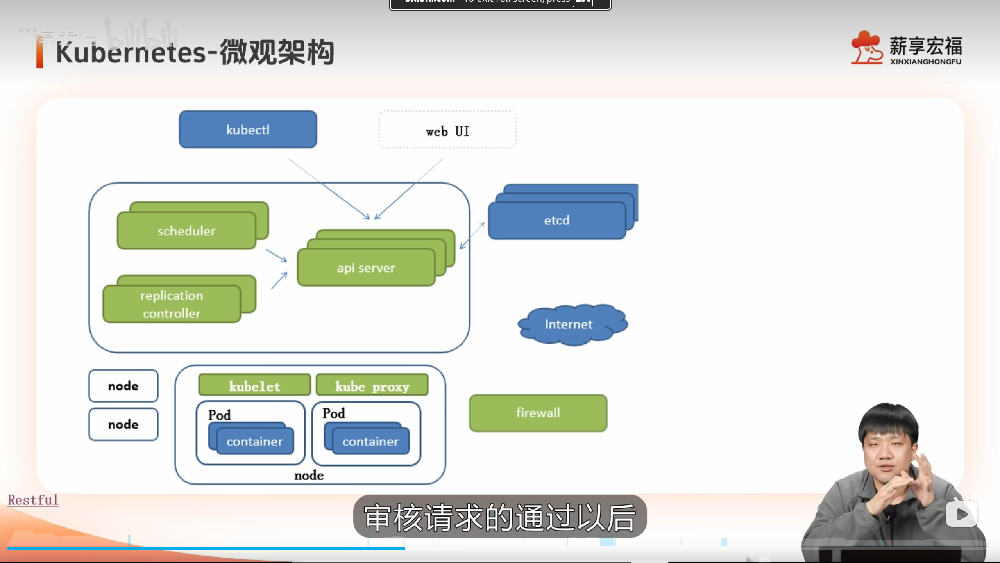
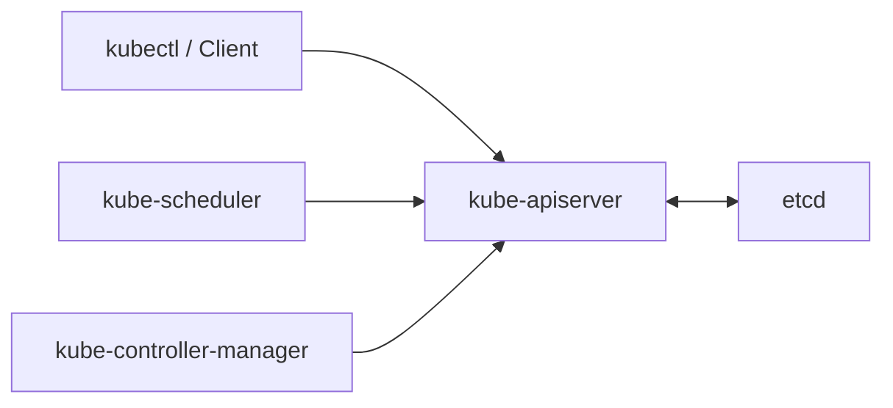
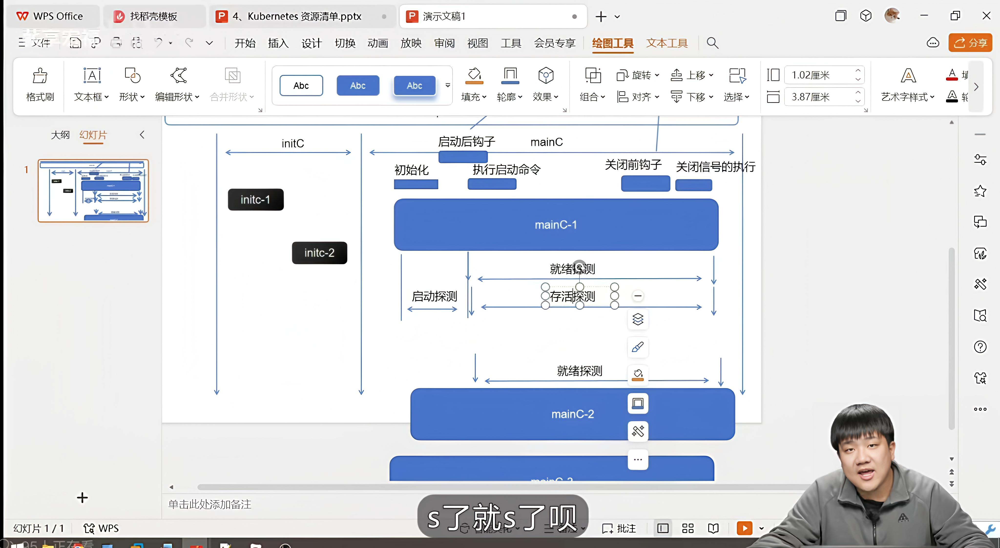
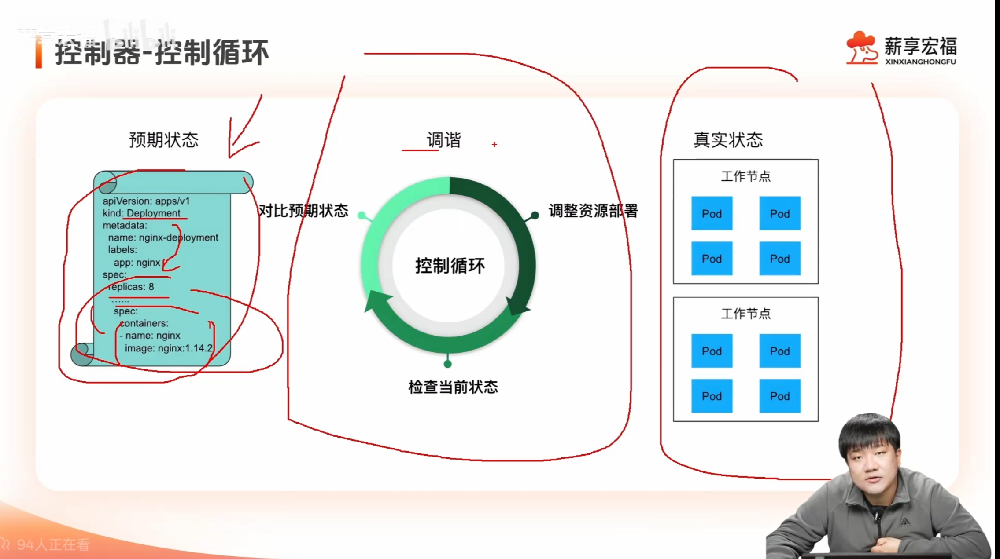

# k8s学习笔记整理

****K8S简单架构**



K8s的核心思想就是分为**控制面 control-plane** 和**节点端 node**

把你需要的资源清单存储在etcd中，然后通过**reconcil调谐**去进行不断趋进近你想要的资源情况

详细讲解架构的话认为可以分成三个部分 ： **控制面 / 节点 / 系统组件**

## 1. 控制面



- **kube-apiserver**：K8s 的统一 API 入口。
- **etcd**：保存整个集群状态。
- **kube-scheduler**：决定 Pod 放到哪个 Node。
- **kube-controller-manager**：持续把实际状态调整到期望状态。

> **控制面负责状态、决策和调度。**
> 

---

## 2. Node 与网络


- **kubelet**：Node 上的管理者，负责 Pod 生命周期。
- **containerd / CRI-O**：容器运行时，真正运行容器。
- **CNI**：负责 Pod IP 和 Pod 间网络通信。
- **kube-proxy** ：负责 Service 到后端 Pod 的流量转发。

> **Node 层负责真正运行 Pod 和完成网络通信。**
> 

---

## 3. 系统组件


- **CoreDNS**：负责集群内部 DNS，`服务名 → Service IP`。
- **Service**：有四种类型，工作在L4,负责的是ip和端口的转发。
- **Ingress Controller**：外选组件，工作在L7，负责的是基于URL等信息的转发。
- **metrics-server**：提供 Node 和 Pod 的 CPU、内存指标。
- **CSI Driver**：负责持久化存储的创建、挂载和卸载。

> **系统组件负责 DNS、服务入口、监控和存储等基础能力。**
> 

<aside>
💡

OSI七层网络模型

1. **物理层 L1**：传 0 和 1，比如网线、光纤。
2. **数据链路层 L2**：看 MAC 地址，负责局域网内通信。
3. **网络层 L3**：看 IP 地址，负责跨网段路由。
4. **传输层 L4**：看 TCP/UDP + 端口，负责进程之间通信。
5. **会话层 L5**：管理通信会话。
6. **表示层 L6**：处理编码、加密、压缩、数据格式。
7. **应用层 L7**：HTTP、DNS、FTP 这些应用协议。
</aside>

举一个简单的例子

比如你执行：

```bash
kubectl apply -f deployment.yaml
```

这个 Deployment 里写：

```yaml
replicas: 3
```

意思是：**我希望集群里一直有 3 个这个应用的 Pod。**

完整链路就是：

```
kubectl
  ↓
kube-apiserver
  ↓
etcd 保存这个 Deployment
  ↓
Controller 发现现在没有 3 个 Pod
  ↓
创建 Pod
  ↓
Scheduler 给每个 Pod 选择 Node
  ↓
对应 Node 上的 kubelet 发现任务
  ↓
kubelet 调 containerd 创建容器
  ↓
CNI 给 Pod 配网络、分配 IP
  ↓
Pod Running
```

如果你再创建一个 Service：

```
Service
  ↓
Pod1
Pod2
Pod3
```

其他 Pod 就可以通过稳定的 Service 地址访问这 3 个 Pod。

如果再加 Ingress：

```
Internet
  ↓
Ingress Controller
  ↓
Service
  ↓
Pod
```

外部 HTTP/HTTPS 请求也能进来。

之后如果某个 Pod 挂了：

```
期望：3 个
实际：2 个
```

Controller 会再次发现不一致，然后补一个新的 Pod。

所以整个 Kubernetes 最核心的运行逻辑就是：

> **你声明想要什么 → 控制面记录并做决策 → Node 真正执行 → 实际状态不对就自动继续调整。**
> 

接下来我会按照 **Pod，Control-Plane，网络，存储，扩展，运维**的顺序讲解 。

> 该笔记适合有一定k8s相关使用基础的人阅读，0基础可能需要进行ai辅助的学习。
> 

# Pod

Pod是K8S中的最小调度单元，如何承接一个或多个紧密相关的容器，在Node上的关系可以理解为，Node就是一个机器，Node上有Pod，Pod里有容器。通过我们构建的业务镜像，可以去创建容器。

## Pod的生命周期



Pod的生命周期里，我们的业务主容器之外的机制可以分为三类：

**Init容器，hook钩子，probe探针**

1. **Init Container**
    
    作用就是在业务容器启动前做一些初始化工作，比如等待依赖服务、拉取配置、初始化目录、修改权限。
    
    **Init Container 是最先执行的**，只有它执行成功之后，业务容器才会启动，后面的 Hook 和 Probe 才会进入对应的生命周期阶段。
    
2. **Hook**
    
    Hook 是容器生命周期里的回调机制，**和 Probe 之间没有严格的先后顺序要求**。
    
    一共有两种：
    
    - `postStart`：容器启动后触发，用来做启动后的额外操作。
    - `preStop`：容器停止前触发，常用来做优雅下线、清理资源。
3. **Probe**
    
    Probe 是 kubelet 用来检查容器状态的机制。
    
    一共有三种：
    
    - `startupProbe`：判断应用是否已经启动完成。
    - `readinessProbe`：判断应用现在是否可以接收流量。
    - `livenessProbe`：判断应用是否还健康、是否需要重启。
    
    Probe 内部有明确的时间关系：
    
    > **如果配置了 startupProbe，那么 startupProbe 成功之前，readinessProbe 和 livenessProbe 都不会开始正常工作。**
    > 

以一个最简单的 Pod 资源清单为例：

```yaml
apiVersion: v1
kind: Pod

metadata:
  name: nginx-pod

spec:
  containers:
    - name: nginx
      image: nginx:latest
      ports:
        - containerPort: 80
```

资源清单通常就按这几个部分写：

- `apiVersion`：使用哪个 Kubernetes API 版本。
- `kind`：要创建什么资源，比如 `Pod`、`Deployment`、`Service`。
- `metadata`：资源的基本信息，比如名称、标签。
- `spec`：资源的具体配置，也就是“你希望它怎么运行”。

这个例子的意思就是：

> 创建一个叫 `nginx-pod` 的 Pod，里面运行一个 `nginx:latest` 容器，并声明容器使用 80 端口。
> 

所以你可以先把 Kubernetes YAML 的基本骨架记成：

```yaml
apiVersion:
kind:
metadata:
spec:
```

绝大多数资源清单都是在这个骨架上继续往 `spec` 里面加配置。

## Pod控制器

从创建的资源到Node节点上的kubelet去实际创建pod之间，还隔着两个关键的组件，**Scheduler和Controller，**Controller负责对比资源清单reconcil去创建资源，Scheduler就负责把创建好的资源绑定在Node上。

而Pod控制器，就是指针对各种pod的controller。



Pod的多种控制器以不同的手段管理Pod，而这些不同类型的资源又被称为**Workload。**

Workload就是资源清单中Kind中的一类，也是日常使用中接触到的最多最重要的一类。

而Workload一共有7种类型。

| Workload | 作用 |
| --- | --- |
| **Pod** | 最基本的运行单元 |
| **Deployment** | 管理无状态应用，支持副本和滚动更新 |
| **ReplicaSet** | 保证指定数量的 Pod 存活 |
| **StatefulSet** | 管理有状态应用，保证名称、顺序和存储稳定 |
| **DaemonSet** | 保证每个或指定 Node 上运行一个 Pod |
| **Job** | 执行一次性任务，完成后结束 |
| **CronJob** | 按时间计划周期性创建 Job |

### Pod

Pod 是 Kubernetes 最小的调度和部署单元。

一个 Pod 里可以有一个或多个容器，这些容器共享网络环境和部分存储资源。

```yaml
apiVersion: v1
kind: Pod
metadata:
  name: nginx-pod

spec:
  containers:
    - name: nginx
      image: nginx:latest
      ports:
        - containerPort: 80  
```

---

### Deployment

Deployment 是最常用的 Workload，主要管理**无状态应用**。

它支持：

- 副本管理
- 扩缩容
- 滚动更新
- 版本回滚

典型场景是 Web 服务、API 服务、后端微服务。

```yaml
apiVersion: apps/v1
kind: Deployment
metadata:
  name: nginx-deployment

spec:
  replicas: 3

  selector:
    matchLabels:
      app: nginx

  template:
    metadata:
      labels:
        app: nginx

    spec:
      containers:
        - name: nginx
          image: nginx:latest
          ports:
            - containerPort: 80
```

这里表示：

> 创建一个 Deployment，并始终维持 3 个 nginx Pod。
> 

---

### ReplicaSet

ReplicaSet 的作用是：

> **保证指定数量的 Pod 存在。**
> 

实际项目里一般不直接使用 ReplicaSet，而是由 Deployment 自动创建和管理。

```yaml
apiVersion: apps/v1
kind: ReplicaSet
metadata:
  name: nginx-rs

spec:
  replicas: 3

  selector:
    matchLabels:
      app: nginx

  template:
    metadata:
      labels:
        app: nginx

    spec:
      containers:
        - name: nginx
          image: nginx:latest
```

这里表示：

> 始终保证存在 3 个带 `app: nginx` 标签的 Pod。
> 

---

### StatefulSet

StatefulSet 用于管理**有状态应用**。

它强调：

- Pod 名称稳定
- Pod 启停顺序稳定
- 可以绑定独立持久化存储

例如 Pod 名字可能是：

```
mysql-0
mysql-1
mysql-2
```

简单例子：

```yaml
apiVersion: apps/v1
kind: StatefulSet
metadata:
  name: mysql

spec:
  serviceName: mysql
  replicas: 3

  selector:
    matchLabels:
      app: mysql

  template:
    metadata:
      labels:
        app: mysql

    spec:
      containers:
        - name: mysql
          image: mysql:8
          env:
            - name: MYSQL_ROOT_PASSWORD
              value: "123456"
```

这里会创建：

```
mysql-0
mysql-1
mysql-2
```

---

实际生产里 StatefulSet 通常还会配合 PVC 去完整稳定状态的效果。

### DaemonSet

DaemonSet 的作用是：

> **保证每个 Node，或者指定的一批 Node 上，都运行一个 Pod。**
> 

典型用于：

- 日志 Agent
- 监控 Agent
- CNI 网络插件
- 安全 Agent

```yaml
apiVersion: apps/v1
kind: DaemonSet
metadata:
  name: node-agent

spec:
  selector:
    matchLabels:
      app: node-agent

  template:
    metadata:
      labels:
        app: node-agent

    spec:
      containers:
        - name: agent
          image: busybox
          command:
            - sh
            - -c
            - "while true; do echo running; sleep 60; done"
```

如果集群有 3 个 Node，通常就会跑 3 个这样的 Pod。

---

### Job

Job 用于执行**一次性任务**。

任务执行成功以后就结束，不要求 Pod 一直运行。

```yaml
apiVersion: batch/v1
kind: Job
metadata:
  name: hello-job

spec:
  template:
    spec:
      restartPolicy: Never

      containers:
        - name: hello
          image: busybox
          command:
            - sh
            - -c
            - "echo hello && sleep 5"
```

这个 Job 会：

```
创建 Pod
  ↓
执行命令
  ↓
执行成功
  ↓
Pod 退出
  ↓
Job Completed
```

---

### CronJob

CronJob 是**定时创建 Job**。

比如每 5 分钟执行一次任务：

```yaml
apiVersion: batch/v1
kind: CronJob
metadata:
  name: hello-cronjob

spec:
  schedule: "*/5 * * * *"

  jobTemplate:
    spec:
      template:
        spec:
          restartPolicy: Never

          containers:
            - name: hello
              image: busybox
              command:
                - sh
                - -c
                - "echo hello"
```

关系就是：

```
CronJob
   ↓ 定时创建
Job
   ↓
Pod
   ↓
执行任务
```

- `/5 * * * *` 表示每 5 分钟执行一次。

# Controll-plane

**controll-plane** 控制面是K8s集群中最重要也是最核心的部分，是整个k8s的中枢，包括资源的存储，调度，controller，还有鉴权/认证/准入等核心机制都在这个部分，按照模块可以分为四个部分

| 控制面组件 | 作用 |
| --- | --- |
| **kube-apiserver** | 统一 API 入口，负责认证、鉴权、准入、资源读写 |
| **etcd** | 保存整个集群的持久化状态 |
| **kube-scheduler** | 给未调度的 Pod 选择合适的 Node |
| **kube-controller-manager** | 运行各种 Controller，持续让实际状态逼近期望状态 |

## api-Server

**apiserver** 是集群的入口，以及资源状态管理的中枢，负责聚合API，鉴权认证，etcd链接，List/Watch，以及版本控制

### 1. REST API + API 聚合

`kube-apiserver` 是整个 Kubernetes 的统一 API 入口。

像这些操作：

```bash
kubectl get pods
kubectl apply -f deployment.yaml
kubectl delete pod nginx
```

本质上都是在调用 API Server 提供的 REST API。

同时它还支持 **API 聚合**，可以把额外的 API 接进 Kubernetes，比如：

```
metrics.k8s.io
```

所以这一块可以记：

> **负责对外提供 Kubernetes API，并允许扩展 API。**
> 

---

### 2. 认证 + 鉴权 + 准入控制 + 资源校验

请求进入 API Server 后，需要经过一系列检查：

```
请求
 ↓
认证 Authentication
 ↓
鉴权 Authorization
 ↓
准入 Admission
 ↓
资源校验
```

分别解决：

- **认证**：你是谁
- **鉴权**：你有没有权限做这件事
- **准入控制**：这个请求是否允许、是否需要修改
- **资源校验**：你提交的 Pod、Deployment 等对象是否合法

比如你要创建 Pod：

> 先确认身份 → 再检查你有没有 create Pod 权限 → 再检查是否符合集群策略 → 最后检查 YAML/API 对象是否合法。
> 

---

### 3. etcd 读写

API Server 负责 Kubernetes API 对象和 etcd 之间的读写。

例如：

```
kubectl apply
   ↓
API Server
   ↓
etcd
```

etcd 里面保存：

```
Pod
Deployment
Service
Node
ConfigMap
Secret
PVC
...
```

所以：

> **API Server 负责访问资源，etcd 负责持久化资源状态。**
> 

其他组件一般不会直接去操作 etcd。

---

### 4. List / Watch

这是 Controller、Scheduler、kubelet、Operator 感知资源变化的重要机制。

`List`：

> 先拿到当前有哪些资源。
> 
> 
> 所以这一块可以记：
> 
> > **resourceVersion 用于资源并发控制和 Watch 版本衔接。**
> > 
> 
> 整个 kube-scheduler 可以压成一条主线：
> 

例如：

```
List Pods
↓
Pod1
Pod2
Pod3
```

`Watch`：

> 继续监听这些资源之后发生的变化。
> 

例如：

```
ADDED Pod4
MODIFIED Pod2
DELETED Pod1
```

典型就是：

```
List
 ↓
获得当前完整状态
 ↓
Watch
 ↓
持续获得增量变化
```

而 Watch 的服务端就是 **kube-apiserver**。

---

### 5. 资源版本控制

每个 Kubernetes 对象都会有类似：

```
resourceVersion
```

这样的版本信息。

它主要解决两个问题：

- **并发修改冲突**
- **List / Watch 的连续性**

比如：

```
Controller A 读到 version=100
Controller B 修改后变成 version=101
Controller A 还拿 version=100 去更新
```

API Server 就能发现这是旧版本，避免错误覆盖。

同时 Watch 也可以：

```
从 resourceVersion=100 之后继续监听
```

所以这一块可以记：

> **resourceVersion 用于资源并发控制和 Watch 版本衔接。**
> 

## etcd

etcd 是一个 **强一致、分布式的 Key-Value 数据库**。

在 Kubernetes 里，它主要保存集群的控制状态，比如 Pod、Deployment、Service、Node、ConfigMap、Secret、PVC 等。

通常由 `kube-apiserver` 统一读写 etcd。

## 1. KV 数据模型

etcd 本质上就是：

```
Key → Value
```

Kubernetes 会把不同资源对象按不同 Key 保存进去。

例如可以粗略理解成：

```
/registry/pods/default/nginx
        ↓
      Pod 对象

/registry/services/default/api
        ↓
    Service 对象
```

所以 etcd 不需要复杂的表关系和 JOIN，而是通过 Key 和前缀来组织数据。

这一块主要记：

> **K8s 资源对象很适合映射成 KV 数据。**
> 

---

## 2. Raft 一致性

当 etcd 是多节点集群时，比如：

```
etcd-1
etcd-2
etcd-3
```

这些节点必须保证数据一致。

etcd 使用 **Raft 共识算法**。

典型结构：

```
        Leader
       /      \
Follower    Follower
```

写请求由 Leader 协调，并复制到其他节点。

只有多数节点确认后，写入才算成功。

例如 3 节点：

```
至少 2 个节点确认
```

所以 Raft 主要解决：

> **多个 etcd 节点之间怎么保证对同一次写入达成一致。**
> 

---

## 3. MVCC / Revision

etcd 会给数据变化维护版本。

比如：

```
revision 100
replicas = 3

revision 101
replicas = 4

revision 102
label 被修改
```

`Revision` 可以理解成：

> **etcd 整体数据发生变化时的版本位置。**
> 

MVCC 是多版本并发控制。

它可以让 etcd 在一定范围内保留历史版本，从而支持：

- 一致性读取
- 并发控制
- Watch 从某个版本继续

Kubernetes 里的 `resourceVersion` 和 etcd 的版本机制关系很深。

---

## 4. Watch 机制

etcd 可以监听：

- 某个 Key
- 某个 Key 前缀

例如：

```
Watch /registry/pods/
```

Pod 相关的数据发生变化后，就可以收到变化事件。

可以简单理解成：

```
etcd 数据变化
      ↓
etcd Watch
      ↓
API Server
      ↓
Kubernetes Watch
      ↓
Controller / kubelet / Operator
```

注意：

> Controller 一般不是直接 Watch etcd，而是 Watch kube-apiserver。
> 

所以 etcd 的 Watch 更偏底层能力。

---

## 5. 高可用集群

生产环境通常不会只部署一个 etcd。

因为单节点一旦挂掉：

```
etcd 挂了
   ↓
API Server 无法正常读写状态
   ↓
控制面受到严重影响
```

所以常见部署：

```
3 个节点
或
5 个节点
```

3 节点可以容忍 1 个节点故障。

5 节点可以容忍 2 个节点故障。

原因是 Raft 需要多数派：

```
3 节点 → 至少 2 个存活
5 节点 → 至少 3 个存活
```

所以这一块主要记：

> **etcd 通过多节点 + Raft 多数派实现高可用。**
> 

---

## 6. 备份与恢复

etcd 保存的是 Kubernetes 整个集群的控制状态，所以备份非常重要。

通常会做：

```
etcd
 ↓
Snapshot
 ↓
备份文件
```

如果 etcd 数据损坏，可以通过 Snapshot 做 Restore。

所以：

> **备份 etcd，本质上就是备份 Kubernetes 的控制状态。**
> 

---

最终可以记成：

```
etcd
├── KV 数据模型
├── Raft 一致性
├── MVCC / Revision
├── Watch
├── 高可用集群
└── 备份与恢复
```

其中最核心的是：

> **KV 负责怎么存，Raft 负责多节点一致，Revision/MVCC 负责版本，Watch 负责感知变化。**
> 

## kube-scheduler


`kube-scheduler` 是 Kubernetes 控制面的调度组件。

它的核心职责是：

> **给还没有绑定 Node 的 Pod 选择一个合适的 Node。**
> 

它不负责创建 Pod，也不负责真正启动容器。

### 1. 调度流程

Scheduler 一次完整调度，核心就是：

```
调度队列
  ↓
Filter
  ↓
Score
  ↓
选择 Node
  ↓
Bind
```

#### 调度队列

Scheduler 会关注那些：

```
已经创建
但还没有绑定 Node
```

的 Pod。

典型就是：

```yaml
spec:
  nodeName: ""
```

这些 Pod 会进入调度队列，等待 Scheduler 处理。

---

#### Filter

Filter 就是：

> **先把一定不能运行这个 Pod 的 Node 全部过滤掉。**
> 

例如 Pod 要求：

```yaml
resources:
  requests:
    cpu: "4"
```

那么：

```
Node A：只剩 2 CPU → 淘汰
Node B：剩 8 CPU → 保留
Node C：剩 6 CPU → 保留
```

再比如：

```yaml
nodeSelector:
  gpu: "true"
```

那么没有 `gpu=true` 标签的 Node 就直接被过滤。

所以 Filter 是一个：

> **硬性条件筛选阶段。**
> 

如果 Filter 完以后：

```
0 个 Node
```

那么这次调度就失败，Pod 继续 Pending。

---

#### Score

假设 Filter 后还剩：

```
Node A
Node B
Node C
```

这些 Node 理论上都能运行 Pod。

这时候 Scheduler 就需要判断：

> 哪一个更合适？
> 

于是进入 Score。

比如：

```
Node A → 70 分
Node B → 95 分
Node C → 82 分
```

最后通常选择：

```
Node B
```

Score 主要处理的是**偏好**，而不是硬性要求。

所以可以记：

> **Filter 判断能不能去，Score 判断更应该去哪。**
> 

---

#### 选择 Node

多个 Score Plugin 的结果会经过计算，Scheduler 最终得到一个候选 Node。

例如：

```
Pod → node-3
```

---

#### Bind

最后 Scheduler 把 Pod 和 Node 绑定起来。

逻辑上就是：

```
Pod
↓
绑定
↓
node-3
```

之后 kubelet 发现：

> 这个 Pod 已经被分配给我了。
> 

然后 kubelet 才会调用 CRI、CNI、CSI 等组件真正创建运行环境。

所以 Scheduler 和 kubelet 的边界一定要分清：

> **Scheduler 决定在哪跑，kubelet 负责真的跑起来。**
> 

---

### 2. 调度策略

这里讲的是：

> **Scheduler 根据什么规则决定一个 Pod 能不能去某个 Node，以及更喜欢哪个 Node。**
> 

主要有这些。

#### resources / requests

Scheduler 看的是 Pod 的：

```yaml
resources:
  requests:
    cpu: "2"
    memory: "4Gi"
```

注意：

> Scheduler 调度主要参考 `requests`，不是看 Pod 当前真实 CPU 使用率。
> 

例如：

```
Node 总 CPU = 8
已有 Pod requests = 6
新 Pod requests = 4
```

那么：

```
6 + 4 > 8
```

这个 Node 就会被 Filter 掉。

---

#### nodeSelector

最简单的节点选择方式。

例如：

```yaml
nodeSelector:
  gpu: "true"
```

意思就是：

> 这个 Pod 只能去带 `gpu=true` 标签的 Node。
> 

特点：

- 简单
- 硬性要求
- 表达能力有限

---

#### Node Affinity


Node Affinity 可以理解成：

> nodeSelector 的增强版。
> 

它可以表达：

- 必须满足
- 最好满足

例如硬性：

```
必须调度到 SSD 节点
```

软性：

```
最好调度到 SSD 节点
```

对应两类：

```
requiredDuringScheduling...
preferredDuringScheduling...
```

其中：

- `required` 主要参与 Filter
- `preferred` 主要参与 Score

---

#### Pod Affinity / Anti-Affinity

这里看的不是 Node 标签，而是：

> **其他 Pod 在哪里。**
> 

Pod Affinity：

> 希望和某些 Pod 放在一起。
> 

例如：

```
Web Pod
希望靠近 Cache Pod
```

Pod Anti-Affinity：

> 希望或要求和某些 Pod 分开。
> 

例如三个副本：

```
Pod1 → Node A
Pod2 → Node B
Pod3 → Node C
```

这样某一个 Node 挂了，不会把所有副本一起干掉。

---

#### Taint / Toleration


这是 Kubernetes 非常重要的一套机制。

Node 可以打污点：

```
Taint
```

表达：

> 默认情况下，我不希望普通 Pod 来这里。
> 

Pod 如果有对应：

```
Toleration
```


意思就是：

> 我可以容忍这个污点。
> 

关系可以记：

```
Node Taint
+
Pod Toleration
```

不是“强制 Pod 去这个 Node”，而是：

> **允许这个 Pod 不因为该污点被排斥。**
> 

这是一个很常见的面试坑。

具体关于taint和toleration的讲解可以参考我的一篇文章：

[https://juejin.cn/post/7676091857219354662](https://juejin.cn/post/7676091857219354662)

---

#### Topology Spread

用来控制 Pod 在不同拓扑域之间怎么分布。

例如：

```
Zone A：2 个
Zone B：2 个
Zone C：2 个
```

而不是：

```
Zone A：6 个
Zone B：0
Zone C：0
```

常见拓扑域：

- Node
- Zone
- Region

主要是为了：

> 高可用和故障隔离。
> 

---

#### Volume / PVC

调度还可能受到存储限制。

例如 PVC 对应的 PV 只能在：

```
zone-a
```

那么 Pod 就不能随便调度到：

```
zone-b
```

所以 Scheduler 还需要考虑：

> 这个 Node 是否能使用 Pod 所需要的 Volume。
> 

---

### 3. 失败处理与抢占

#### Pending

如果 Scheduler 找不到合适 Node，Pod 通常会保持：

```
Pending
```

例如：

```
0/3 nodes are available
```

常见原因：

- CPU 不够
- 内存不够
- nodeSelector 不匹配
- Affinity 不满足
- Taint 没有对应 Toleration
- PVC / Volume 不满足
- 端口等其他调度条件冲突

这里要注意：

> Pending 不等于一定是 Scheduler 问题。
> 

如果 Pod 已经绑定 Node，但卡在镜像拉取、CNI、Init Container 等阶段，也可能看到 Pending。

所以判断时先看：

```
有没有 spec.nodeName
```

---

#### 调度失败重试

如果第一次没调度成功，Scheduler 不会直接放弃这个 Pod。

它会保留这个 Pod，并在合适的时候重新尝试。

例如：

```
Pod A
↓
没有合适 Node
↓
Unschedulable
↓
等待
↓
Node 资源变化
↓
重新调度
```

---

#### Backoff

如果某个 Pod 反复调度失败，Scheduler 不会疯狂死循环重试。

会有：

> **退避机制 Backoff**
> 

也就是失败越频繁，短时间内不会立即不断重试。

---

#### PriorityClass

Kubernetes 可以给 Pod 设置优先级。

例如：

```
核心系统 Pod：100000
普通业务 Pod：1000
测试 Pod：100
```

Scheduler 会更优先处理高优先级 Pod。

---

#### Preemption

如果一个高优先级 Pod 没地方运行，Scheduler 可能考虑：

> 把低优先级 Pod 腾出去。
> 

例如：

```
Node：
低优先级 Pod A
低优先级 Pod B

高优先级 Pod C 来了
但资源不够
```

Scheduler 可能判断：

```
驱逐 A
↓
释放资源
↓
C 可以运行
```

这就是抢占。

注意：

> Preemption 是为了让高优先级 Pod 获得调度机会，不代表一有高优先级 Pod 就一定会杀低优先级 Pod。
> 

---

### 4. 扩展机制

这一块你可以先掌握概念，不需要一开始钻实现。

#### Scheduler Framework

现代 kube-scheduler 提供：

> **Scheduler Framework**
> 

它把整个调度过程拆成很多扩展点。

例如：

```
PreFilter
Filter
PostFilter
PreScore
Score
Reserve
Permit
PreBind
Bind
PostBind
```

你可以写 Plugin 插进去。

例如自定义一个 AI 算力调度插件：

```
Filter：
没有 GPU 的 Node 直接淘汰

Score：
显存越多分越高
```

这就是典型的 Scheduler Plugin。

---

#### Scheduling Plugin

Plugin 就是具体实现某个调度逻辑的插件。

Kubernetes 自己很多默认调度逻辑，本身也是 Plugin。

所以现在 kube-scheduler 更准确的理解是：

> **一个调度框架 + 一组调度插件。**
> 

---

#### 多 Scheduler

一个 Kubernetes 集群里可以存在多个 Scheduler。

例如：

```
default-scheduler
ai-scheduler
```

Pod 可以指定：

```yaml
spec:
  schedulerName: ai-scheduler
```

这样这个 Pod 就由 `ai-scheduler` 负责。

---

#### 自定义 Scheduler

如果默认 Scheduler 无法满足业务需求，可以自己实现 Scheduler。

典型场景：

- GPU 调度
- AI 训练任务
- 批处理任务
- 特殊 NUMA / topology 调度
- 成本调度
- 特殊硬件调度

不过现在一般优先考虑：

> **基于 Scheduler Framework 写 Plugin**
> 

---

## kube-controller-manager

`kube-controller-manager` 是 Kubernetes 控制面的控制器管理组件。

它内部运行很多 Controller，这些 Controller 会持续通过 API Server 观察集群中的资源状态，然后执行 Reconcile，把**实际状态不断拉回期望状态**。

最核心的一句话：

> **Controller 负责“发现偏差并修正偏差”。**
> 

---

### 1. Controller / Reconcile 核心机制

Controller 的核心不是“执行一次任务”，而是：

> **持续循环检查：现在是不是已经达到我想要的状态。**
> 

#### Desired State 和 Actual State

比如你创建一个 Deployment：

```yaml
spec:
  replicas: 3
```

这表示：

```
期望状态：
应该有 3 个 Pod
```

实际可能只有：

```
实际状态：
现在只有 2 个 Pod
```

Controller 发现：

```
Desired = 3
Actual = 2
```

于是就会补 1 个。

最终：

```
3 = 3
```

这个过程就是 Reconcile。

---

#### Reconcile Loop

可以理解成：

```
观察资源状态
   ↓
读取期望状态
   ↓
读取实际状态
   ↓
比较
   ↓
如果不一致
   ↓
创建 / 修改 / 删除资源
   ↓
再次观察
```

所以 Kubernetes 的核心思想不是：

> “用户下命令，然后系统执行完就结束。”
> 

而是：

> **用户声明期望状态，Controller 持续保证这个状态成立。**
> 

这就是 Kubernetes 的声明式控制。

---

#### List / Watch

Controller 怎么知道资源发生变化？

主要就是通过 API Server 的：

```
List + Watch
```

典型过程：

```
Controller
   ↓
List
   ↓
先获取当前所有资源状态
   ↓
Watch
   ↓
持续接收后续变化事件
```

比如：

```
Pod ADDED
Pod MODIFIED
Pod DELETED
```

Controller 收到事件之后，就知道可能需要重新 Reconcile。

这里你之前学过：

> Controller 通常 Watch 的是 API Server，不是直接 Watch etcd。
> 

---

#### Informer

实际 Kubernetes Controller 通常不会自己手写：

```
不停 List
不停 Watch
```

而是使用 Informer。

Informer 可以理解成 Controller 和 API Server 之间的一层封装：

```
API Server
   ↓
List / Watch
   ↓
Informer
   ↓
Local Cache
   ↓
Event Handler
   ↓
Controller
```

Informer 主要解决几个问题：

- 封装 List / Watch
- 自动重连
- 维护本地缓存
- 减少 API Server 压力
- 把资源事件交给 Controller

所以 Controller 很多时候并不是每次 Reconcile 都直接去 API Server 全量查。

它可以从 Informer 的本地 Cache 获取对象。

---

#### WorkQueue

Informer 发现变化后，通常不会直接在事件回调里完成所有业务逻辑。

更典型的是：

```
资源变化
↓
Informer Event
↓
把资源 Key 放进 WorkQueue
↓
Worker 从队列取任务
↓
执行 Reconcile
```

例如：

```
default/my-deployment
```

进入 WorkQueue。

Worker 再根据这个 key：

```
namespace/name
```

查对象并执行 Reconcile。

这样做有几个好处：

- 事件接收和处理解耦
- 可以并发处理
- 可以失败重试
- 可以限速
- 同一个资源的多次事件可以合并

这套模式在 Operator 里也非常常见。

---

#### 为什么 Reconcile 要幂等

这是 Controller 非常重要的一点。

同一个资源可能因为：

- Watch 重复事件
- 重试
- Controller 重启
- 网络问题

导致同一个 Reconcile 被执行很多次。

所以应该保证：

> **执行一次和执行很多次，最终结果一致。**
> 

例如：

```
期望 Pod = 3
当前 Pod = 2
```

正确做法是：

```
发现少 1 个
→ 创建 1 个
```

而不是：

```
每收到一次事件
→ 无脑创建一个 Pod
```

否则重复事件就会导致 Pod 越来越多。

所以 Controller 的 Reconcile 天生要求：

> **面向状态，而不是面向事件。**
> 

---

### 2. 典型内置 Controller

`kube-controller-manager` 内部其实运行着很多 Controller。

不需要把所有名字都背下来，重点理解几个典型的。

#### ReplicaSet Controller

负责保证：

> ReplicaSet 实际 Pod 数量 = `spec.replicas`
> 

例如：

```
期望：3
实际：2
```

它就创建 1 个 Pod。

如果：

```
期望：3
实际：4
```

它就删除 1 个 Pod。

---

#### Deployment Controller

Deployment Controller 主要不是直接管理 Pod。

它主要管理：

> ReplicaSet。
> 

比如 Deployment：

```yaml
replicas: 3
image: nginx:v2
```

Deployment Controller 会创建或调整 ReplicaSet。

所以关系是：

```
Deployment
   ↓
Deployment Controller
   ↓
ReplicaSet
```

真正维持 Pod 数量的是 ReplicaSet Controller。

---

#### StatefulSet Controller

负责 StatefulSet 的状态管理。

它不仅关心副本数量，还关心：

- 稳定 Pod 名称
- 创建 / 删除顺序
- PVC 关系
- 滚动更新

例如：

```
mysql-0
mysql-1
mysql-2
```

这些身份通常是稳定的。

---

#### DaemonSet Controller

负责：

> 每个符合条件的 Node 上应该运行一个 Pod。
> 

例如日志采集 Agent：

```
Node A → fluent-bit
Node B → fluent-bit
Node C → fluent-bit
```

如果新增：

```
Node D
```

DaemonSet Controller 会发现：

```
Node D 缺一个 Pod
```

然后创建。

---

#### Job Controller

负责一次性任务。

例如：

```
需要成功运行 10 个任务
```

Job Controller 会持续检查：

- 成功多少
- 失败多少
- 是否需要补 Pod

直到 Job 达到完成条件。

---

#### Node Controller

Node Controller 负责监控 Node 的状态。

例如：

```
Node A
↓
长时间没有心跳
↓
Node Controller 判断异常
↓
Node 状态变为 NotReady / Unknown
```

后续可能引发 Pod 驱逐等处理。

所以 Node 是否健康并不只是 kubelet 自己决定，控制面也会持续判断。

---

#### EndpointSlice Controller

Service 后面需要知道：

> 当前有哪些 Pod 可以作为后端。
> 

EndpointSlice Controller 会根据：

```
Service Selector
+
Pod 状态
```

生成 / 更新 EndpointSlice。

例如：

```
Service: app=web
```

找到：

```
Pod1 10.0.1.1
Pod2 10.0.1.2
Pod3 10.0.1.3
```

形成 EndpointSlice。

后续 kube-proxy / eBPF dataplane 就可以根据这些信息做 Service 转发。

---

### 3. Controller 之间的控制链

这一块非常关键。

Kubernetes 通常不是：

```
一个 Controller 把所有事情全做完
```

而是：

> **不同 Controller 通过 API Resource 串起来。**
> 

#### Deployment 控制链

最经典：

```
Deployment
   ↓
Deployment Controller
   ↓
ReplicaSet
   ↓
ReplicaSet Controller
   ↓
Pod
```

比如你创建：

```yaml
kind: Deployment
spec:
  replicas: 3
```

流程不是 Deployment Controller 直接启动三个容器。

而是：

```
Deployment Controller
↓
创建 ReplicaSet
↓
ReplicaSet Controller
↓
创建 3 个 Pod
↓
Scheduler
↓
给 Pod 选择 Node
↓
kubelet
↓
真正运行容器
```

完整链路：

```
Deployment
↓
Deployment Controller
↓
ReplicaSet
↓
ReplicaSet Controller
↓
Pod
↓
Scheduler
↓
Node
↓
kubelet
↓
Container
```

---

#### Controller 操作的是 API Resource

这一点一定要明确。

Controller 一般不是：

```
直接 SSH 到 Node
直接启动 nginx
直接杀进程
```

而是：

```
创建 / 修改 / 删除 API Resource
```

例如 ReplicaSet Controller 想增加一个 Pod：

```
ReplicaSet Controller
↓
向 API Server 创建 Pod Object
```

后面的 Scheduler、kubelet 自然会接手。

所以：

> **Kubernetes 各组件之间主要通过 API Object 解耦。**
> 

---

#### Controller 之间不是直接互相调用

通常不是：

```
Deployment Controller
直接调用
ReplicaSet Controller
```

而是：

```
Deployment Controller
↓
创建 ReplicaSet Object
↓
ReplicaSet Controller Watch 到 ReplicaSet
↓
开始自己的 Reconcile
```

因此更准确地说：

> **Controller 之间通过共享的 API 状态间接协作。**
> 

这也是 Kubernetes 架构非常重要的特点。

---

#### OwnerReference

Controller 怎么知道：

> 这个 Pod 是哪个 ReplicaSet 创建的？
> 

通常会用 `ownerReferences`。

例如：

```
Deployment
   ↓ owner
ReplicaSet
   ↓ owner
Pod
```

这会形成资源所有权关系。

它除了帮助 Controller 识别资源，也关系到垃圾回收。

比如删除 Deployment 时，可以根据 ownerReference 清理下面的 ReplicaSet 和 Pod。

---

### 4. 高可用与运行机制

#### 多个 kube-controller-manager

生产 Kubernetes 控制面通常可能运行多个：

```
controller-manager-1
controller-manager-2
controller-manager-3
```

但有个问题：

如果三个实例同时执行同一套 Controller：

```
都发现少一个 Pod
↓
三个都创建
```

就会出问题。

因此需要：

> Leader Election。
> 

---

#### Leader Election

多个 `kube-controller-manager` 实例之间会选出一个 Leader。

例如：

```
controller-manager-1 → Leader
controller-manager-2 → Standby
controller-manager-3 → Standby
```

主要由 Leader 执行控制逻辑。

如果 Leader 挂掉：

```
Leader 挂掉
↓
剩余实例重新选举
↓
选出新 Leader
↓
继续运行 Controller
```

这样实现高可用。

---

#### 为什么可以安全切 Leader

因为 Controller 是基于状态 Reconcile 的。

假设旧 Leader 做到一半挂了：

```
期望：3 个 Pod
实际：2 个 Pod
```

新 Leader 上来以后不用知道：

> “旧 Leader 做到了第几步？”
> 

它只需要重新观察：

```
Desired = 3
Actual = 2
```

然后继续补。

这就是声明式系统 + 幂等 Reconcile 的巨大优势。

---

#### Controller Manager 和 Scheduler 的区别

这两个非常容易混。

Controller Manager：

> **决定系统状态需不需要被修正。**
> 

Scheduler：

> **决定一个未绑定 Pod 应该去哪台 Node。**
> 

比如 Deployment 要 3 个副本，现在只有 2 个：

```
ReplicaSet Controller
↓
创建第 3 个 Pod
```

这个新 Pod 没 Node：

```
Scheduler
↓
选择 Node B
```

然后：

```
Node B kubelet
↓
真正运行 Pod
```

所以可以记成：

```
Controller：要不要创建这个 Pod？
Scheduler：这个 Pod 去哪里？
kubelet：把这个 Pod 真正跑起来。
```

---

整个 `kube-controller-manager` 可以压成这一条主线：

```
API Server
   ↓
List / Watch
   ↓
Informer
   ↓
Local Cache
   ↓
Event
   ↓
WorkQueue
   ↓
Controller Worker
   ↓
Reconcile
   ↓
创建 / 修改 / 删除 API Resource
   ↓
实际状态逐渐接近期望状态
```

最核心一句：

> **kube-controller-manager 本质上就是运行大量 Reconcile Loop，通过持续操作 API Resource，把 Kubernetes 的实际状态维持在声明的期望状态。**
> 

# Net-Working

Kubernetes 网络这块，可以分为七个部分：**pod的网络模型，CNI插件，Service，Service数据面，CoreDNS，Ingress，**还有网络限制策略 **NetworkPolicy**

---

## Pod 网络模型

Kubernetes 网络首先要理解一个核心：

> **Pod 是 Kubernetes 网络通信的基本单位。**
> 

每个 Pod 通常都有一个独立的 Pod IP。

比如：

```
Pod A → 10.244.1.10
Pod B → 10.244.2.20
```

Pod 之间原则上可以直接通过 Pod IP 通信：

```
Pod A
↓
10.244.2.20
↓
Pod B
```

这里不要求 Pod 自己做 NAT。

#### 同一个 Pod 的多个容器

同一个 Pod 中的容器共享同一个 Network Namespace，所以：

- 共用一个 Pod IP
- 共用端口空间
- 可以通过 `localhost` 通信

比如：

```
Pod
├── app-container :8080
└── sidecar       :15000
```

sidecar 可以直接访问：

```
localhost:8080
```

因为它们本质上处于同一个网络命名空间中。

#### Pod IP 为什么不适合直接给业务使用

Pod 是可替换的。

例如：

```
Pod A
IP = 10.244.1.10
```

Pod 被删除重建：

```
Pod A'
IP = 10.244.2.35
```

IP 可能就变了。

所以虽然 Pod IP 可以通信，但业务一般不能依赖固定 Pod IP。

这就引出了后面的 Service。

---

## CNI 与跨节点通信

Pod 要有 IP、网卡、路由，这些东西是谁配置的？

就是 CNI。


CNI 全称：

> **Container Network Interface**
> 

它本质上是一套容器网络接口规范。

Kubernetes 通过 CNI Plugin 来完成 Pod 网络配置。

常见 CNI：

- Flannel
- Calico
- Cilium

#### Pod 创建时网络大概怎么建立

可以简化成：

```
kubelet
↓
container runtime
↓
创建 Pod Network Namespace
↓
调用 CNI Plugin
↓
创建虚拟网卡
↓
分配 Pod IP
↓
配置路由
```

常见实现里会有 veth pair。

更准确地说：

```
Pod Network Namespace          Node Network Namespace

eth0  <=====================>  vethxxxx
          veth pair
```

Pod 里的 `eth0` 通常就是 veth pair 的 Pod 这一端。

所以：

> **veth pair 就像一根虚拟网线，把 Pod 的网络空间接到 Node 网络里。**
> 

---

#### Pod Network Namespace

Pod Network Namespace 可以理解成：

> **Pod 独立的一套 Linux 网络环境。**
> 

里面有自己的：

- 网卡
- IP
- 路由表
- 端口空间
- 网络状态

同一个 Pod 里的多个容器共享这一套 Network Namespace。

所以：

```
Pod
├── Container A
├── Container B
└── 共享：
    ├── eth0
    ├── Pod IP
    ├── 路由表
    └── 端口空间
```

---

#### Pod IP 怎么分配

CNI 通常会通过 IPAM：

> **IP Address Management**
> 

给 Pod 分配 IP。

例如：

```
Node A PodCIDR → 10.244.1.0/24
```

Node A 上新建 Pod：

```
Pod1 → 10.244.1.2
Pod2 → 10.244.1.3
Pod3 → 10.244.1.4
```

IPAM 负责避免重复分配。

常见思路是：

```
Node A → 10.244.1.0/24
Node B → 10.244.2.0/24
Node C → 10.244.3.0/24
```

不同 Node 使用不重叠的 Pod 网段。

---

#### 同 Node Pod 通信

比如：

```
Node A
├── Pod1 10.244.1.10
└── Pod2 10.244.1.20
```

大致：

```
Pod1 eth0
↓
veth
↓
Node 内部网络
↓
veth
↓
Pod2 eth0
```

因为两个 Pod 都在同一个 Node，所以通常不需要真正经过外部物理网络。

---

#### 跨 Node Pod 通信

真正复杂的是：

```
Node A
└── Pod1 10.244.1.10

Node B
└── Pod2 10.244.2.20
```

Pod1 怎么找到 Pod2？

这就是不同 CNI 的主要实现差异。

常见可以粗分成两类：

#### Overlay / 隧道封装

典型：

- VXLAN
- IPIP

比如 VXLAN：

```
Pod1 原始数据包
↓
Node A 封装
↓
NodeA → NodeB
↓
Node B 解封装
↓
Pod2
```

也就是：

> **把 Pod 数据包外面再套一层 Node-to-Node 的包。**
> 

Flannel 很常见的一种模式就是 VXLAN。

---

#### 路由模式

另一种思路是不额外封装，而是直接让网络知道：

```
10.244.1.0/24 在 Node A
10.244.2.0/24 在 Node B
```

然后直接路由。

Calico 常见可以通过 BGP 分发这些路由。

所以可以先记：

```
VXLAN / IPIP
→ 隧道封装

BGP
→ 路由分发
```

---

## Service

既然 Pod IP 会变，那么业务怎么稳定访问一组 Pod？

Kubernetes 提供 Service。

> **Service 给一组 Pod 提供一个稳定访问入口。**
> 

例如：

```
Pod1 10.244.1.10
Pod2 10.244.2.20
Pod3 10.244.3.30
```

这些 Pod 可能不断变化。

但 Service 可以长期保持：

```
Service ClusterIP
10.96.0.100
```

客户端只需要：

```
访问 10.96.0.100
```

而不用关心后面到底是哪几个 Pod。

---

#### Service 怎么知道后面有哪些 Pod

一般通过 Selector：

```yaml
selector:
  app: web
```

找到：

```
Pod1 label app=web
Pod2 label app=web
Pod3 label app=web
```

然后 Kubernetes 会形成 EndpointSlice。

可以理解成：

```
Service
↓
EndpointSlice
↓
10.244.1.10
10.244.2.20
10.244.3.30
```

所以：

> **Service 是稳定入口，EndpointSlice 保存当前后端 Pod。**
> 

| Service 类型 | 主要用途 | 访问方式 | 是否有 ClusterIP | 典型场景 |
| --- | --- | --- | --- | --- |
| **ClusterIP** | 集群内部访问 | `ServiceIP:Port` | 是 | 微服务内部调用 |
| **NodePort** | 从集群外通过 Node 暴露服务 | `NodeIP:NodePort` | 是 | 测试环境、裸机简单暴露 |
| **LoadBalancer** | 通过外部负载均衡器暴露服务 | `External LB IP` | 是 | 云环境公网服务 |
| **ExternalName** | 把 Service 名映射到外部域名 | DNS CNAME | 否 | 访问集群外数据库、API 等 |

---

#### ClusterIP

默认 Service 类型。

主要用于集群内部：

```
Pod
↓
ClusterIP
↓
Pod
```

---

#### NodePort

会在 Node 上开放一个端口。

例如：

```
NodeIP:30080
```

外部可以：

```
NodeIP:30080
↓
Service
↓
Pod
```

---

#### LoadBalancer

通常用于云环境。

创建：

```yaml
type: LoadBalancer
```

典型：

```
Internet
↓
External Load Balancer
↓
LoadBalancer Service
↓
Pod
```

---

## Service 数据面


这一块先只记 **两个步骤**。

> **第一步：提前准备规则。**
> 
> 
> kube-proxy Watch `Service` 和 `EndpointSlice`，然后把 Service IP 和后端 Pod IP 的对应关系提前写进 `iptables` 或 `IPVS`。
> 

比如：

```
Service:
10.96.0.100:80

EndpointSlice:
10.244.1.10:8080
10.244.2.20:8080
```

kube-proxy Watch 到以后，会提前配置成：

```
10.96.0.100:80
↓
10.244.1.10:8080
10.244.2.20:8080
```

也就是说：

> **EndpointSlice 只是在这个“规则准备阶段”提供后端信息。**
> 

然后是：

> **第二步：真实流量进来。**
> 
> 
> 请求真正访问 Service IP 时，不会再去查询 EndpointSlice，也不会经过 kube-proxy 进程，而是直接由 Linux 内核里的 `iptables` 或 `IPVS` 根据已经准备好的规则转发到某个 Pod。
> 

真实链路：

```
客户端
↓
Service IP
↓
iptables / IPVS
↓
某个 Pod IP
↓
Pod
```

所以最核心的关系就是：

```
Service + EndpointSlice
↓
kube-proxy
↓
提前配置
iptables / IPVS

然后真实请求：
Service IP
↓
iptables / IPVS
↓
Pod
```

### iptables 和 IPVS 是什么

它们是 **kube-proxy 的两种平行实现方案**。

```
kube-proxy
├── iptables 模式
└── IPVS 模式
```

不是先经过 iptables 再经过 IPVS。

#### iptables

`iptables` 可以理解成：

> **Linux 的网络规则系统。**
> 

kube-proxy 会提前生成很多 NAT / 转发规则。

例如：

```
10.96.0.100:80
↓
DNAT
↓
10.244.1.10:8080
```

所以 iptables 的思路就是：

> **靠一系列规则，把 Service IP 改写并转发到 Pod IP。**
> 

#### IPVS

`IPVS` 是：

> **Linux 内核里的四层负载均衡器。**
> 

它天然就是：

```
一个 Virtual Service
↓
多个 Real Server
```

刚好对应：

```
Service
↓
多个 Pod
```

比如：

```
Virtual Service:
10.96.0.100:80

Real Servers:
10.244.1.10:8080
10.244.2.20:8080
```

请求来了之后，IPVS 直接从 Real Server 里选一个后端。

所以一句话区分：

> **iptables 是“用规则实现 Service 转发”；IPVS 是“用专门的 L4 负载均衡器实现 Service 转发”。**
> 

---

---

## CoreDNS

现在 Service 已经有稳定 IP 了，但还有一个问题：

谁愿意在代码里写：

```
10.96.0.100
```

通常我们希望：

```
user-service
```

所以 Kubernetes 有 CoreDNS。

> **CoreDNS 提供集群内部服务发现。**
> 

例如：

```
user-service.default.svc.cluster.local
```

CoreDNS 可以解析成：

```
10.96.0.100
```

也就是 Service ClusterIP。

---

#### 一个完整请求

Pod A 请求：

```
http://user-service
```

过程：

```
Pod A
↓
DNS 查询
↓
CoreDNS
↓
user-service → 10.96.0.100
↓
Pod A 访问 Service IP
↓
kube-proxy
↓
iptables / IPVS 
↓
Pod B
```

所以：

> **CoreDNS 负责“名字 → Service IP”。**
> 

> **kube-proxy + iptables/IPVS 负责“Service IP → Pod IP”。**
> 

---

## Ingress / Ingress Controller

Service 已经解决了稳定访问，但 Web 服务通常还需要：

```
example.com/api
example.com/user
```

这种基于 HTTP 内容的路由。

于是有 Ingress。

#### Ingress

Ingress 是一个 API Resource。

它描述规则：

```
example.com/api
→ api-service

example.com/user
→ user-service
```

它自己不会真正处理流量。

---

#### Ingress Controller

真正处理流量的是 Ingress Controller。

例如：

- NGINX Ingress Controller
- Traefik
- HAProxy Ingress

典型链路：

```
Internet
↓
External Load Balancer
↓
Service
↓
Ingress Controller Pod
↓
读取 Host / Path
↓
业务 Service
↓
Pod
```

比如：

```
example.com/api
↓
Ingress Controller
↓
api-service
↓
API Pods
```

---

#### Service 和 Ingress 的区别

可以简单记：

> **Service 主要解决 L4 的稳定访问和负载均衡。**
> 

> **Ingress 主要解决 L7 HTTP/HTTPS 路由。**
> 

Service 更关注：

```
IP + Port
```

Ingress 更关注：

```
Host
Path
HTTP
HTTPS
TLS
```

---

## NetworkPolicy

默认情况下，Pod 之间通常具有比较开放的网络可达性。

但生产环境可能需要：

```
frontend → backend
backend → database
```

而禁止：

```
frontend → database
```

于是需要 NetworkPolicy。

#### Ingress Policy

控制：

> **谁可以访问我。**
> 

例如：

```
Database
只允许 backend Pod 访问
```

---

#### Egress Policy

控制：

> **我可以访问谁。**
> 

比如：

```
某 Pod
只能访问数据库和 DNS
不能访问其他目标
```

---

#### 怎么选择对象

常见通过：

- `podSelector`
- `namespaceSelector`
- `ipBlock`

例如：

```
允许 namespace=backend
里的 app=api Pod
访问数据库
```

---

#### NetworkPolicy 谁真正执行

NetworkPolicy 本身只是 API Resource。

真正执行要依赖支持 NetworkPolicy 的 CNI。

例如：

- Calico
- Cilium

所以：

```
NetworkPolicy
↓
声明策略

CNI
↓
真正执行策略
```

---

# Storage


主要先讲解volume，比较重要

k8s集群中存储的抽象层次比较多，总共有这些流程

```
Container
↓
volumeMounts
↓
Pod volumes
↓
PVC
↓
PV
↓
真实存储
```

普通 Volume 挂载和 Docker Volume 的思路比较接近，Pod 里主要通过 **volumes** 和 **volumeMounts** 两部分完成。**volumes** 定义这个 Volume 的来源，**volumeMounts** 负责把这个 Volume 挂载到容器里的指定路径。

**PV/PVC** 的出现，是为了把 Pod 和底层真实存储解耦。Pod 不需要知道底层到底是本地盘、NFS、Ceph 还是云盘，只需要通过 **PVC** 表达“我要什么样的存储”，再由 **PV** 对应实际的持久化存储资源。

**StorageClass** 用来描述“这一类存储应该怎么动态创建”。PVC 通过 **storageClassName** 选择某个 StorageClass，StorageClass 再通过 **provisioner** 指向对应的 **CSI Driver**，由 CSI Driver 创建真实存储并动态生成 PV，从而避免管理员手动创建 PV。

---

### 1. Pod Volume 基础

无论后面接的是 `emptyDir`、`hostPath` 还是 PVC，Pod 里基本都绕不开两个东西：

- `volumeMounts`
- `volumes`

可以先记：

> `volumes` 决定“存储从哪里来”
> 
> 
> `volumeMounts` 决定“挂到容器里的哪里”
> 

比如：

```yaml
apiVersion: v1
kind: Pod
metadata:
  name: demo
spec:
  containers:
  - name: app
    image: nginx
    volumeMounts:
    - name: data
      mountPath: /data

  volumes:
  - name: data
    emptyDir: {}
```

这里：

```
volumes
= 定义 data 这个 Volume 从哪里来

volumeMounts
= 把 data 挂到容器的 /data
```

所以：

```
emptyDir
↓
Pod Volume: data
↓
volumeMounts
↓
Container /data
```

#### emptyDir

```yaml
volumes:
- name: data
  emptyDir: {}
```

特点：

> Pod 创建时产生，Pod 删除时消失。
> 

所以适合：

- 临时缓存
- 中间文件
- 同 Pod 多容器共享数据

---

#### hostPath

```yaml
volumes:
- name: data
  hostPath:
    path: /data
```

表示直接把 Node 上的 `/data` 作为 Pod 的 Volume。

再配：

```yaml
volumeMounts:
- name: data
  mountPath: /app/data
```

最终：

```
Node /data
↓
Pod Volume
↓
Container /app/data
```

问题是：

```
Pod 今天在 Node A
↓
使用 Node A /data

Pod 明天重建到 Node B
↓
Node B /data 可能不是同一份数据
```

所以 `hostPath` 很依赖 Node，不适合作为通用持久化方案。

---

### 2. 持久化存储：PV / PVC


PV/PVC 本质上就是：

> **在 Pod 的 `volumes` 和真实存储之间再抽象一层。**
> 

普通 Volume：

```
Container
↓
volumeMounts
↓
Pod volumes
↓
真实存储
```

PV/PVC：

```
Container
↓
volumeMounts
↓
Pod volumes
↓
PVC
↓
PV
↓
真实存储
```

#### PV 是什么

PV，`PersistentVolume`：

> **集群里的一块持久化存储资源。**
> 

比如：

```
PV:
容量 100Gi
底层是一块磁盘 / NFS / Ceph / 云盘
```

示例：

```yaml
apiVersion: v1
kind: PersistentVolume
metadata:
  name: pv-demo
spec:
  capacity:
    storage: 100Gi
  accessModes:
  - ReadWriteOnce
  hostPath:
    path: /data/pv-demo
```

这里用 `hostPath` 只是方便演示，生产中 PV 更常对应云盘、Ceph、NFS 等。

---

#### PVC 是什么

PVC，`PersistentVolumeClaim`：

> **业务对存储资源的申请。**
> 

比如：

```yaml
apiVersion: v1
kind: PersistentVolumeClaim
metadata:
  name: pvc-demo
spec:
  accessModes:
  - ReadWriteOnce
  resources:
    requests:
      storage: 20Gi
```

意思就是：

> 我要一块至少 20Gi、满足这种访问模式的存储。
> 

Kubernetes 会找合适的 PV：

```
PVC
20Gi RWO
↓
匹配
↓
PV
100Gi RWO
```

然后：

```
PVC ↔ PV
```

完成绑定。

---

#### Pod 怎么使用 PVC

Pod 还是原来的：

```
volumeMounts + volumes
```

只是 `volumes` 不再直接写：

```yaml
emptyDir: {}
```

而是：

```yaml
persistentVolumeClaim:
  claimName: pvc-demo
```

完整例子：

```yaml
apiVersion: v1
kind: Pod
metadata:
  name: app
spec:
  containers:
  - name: app
    image: nginx
    volumeMounts:
    - name: data
      mountPath: /data

  volumes:
  - name: data
    persistentVolumeClaim:
      claimName: pvc-demo
```

完整关系：

```
Container /data
↓
volumeMounts
↓
Pod Volume: data
↓
PVC: pvc-demo
↓
PV
↓
真实存储
```

所以：

> **PV/PVC 只是让 `volumes` 不再直接指向底层存储，而是先经过 PVC/PV 这一层。**
> 

---

### 3. 动态存储：StorageClass + CSI


PV/PVC 还有一个问题：

> 如果每次 PVC 出现，都要管理员手动创建一个 PV，会比较麻烦。
> 

静态模式：

```
管理员
↓
手动创建 PV
↓
用户创建 PVC
↓
PVC 绑定 PV
```

于是引入动态供应：

> **StorageClass + CSI 自动创建 PV。**
> 

#### StorageClass 是什么

StorageClass 是一个独立 API Resource，可以理解成：

> **“这种 PV 应该怎么创建”的模板。**
> 

例如：

```yaml
apiVersion: storage.k8s.io/v1
kind: StorageClass
metadata:
  name: fast-ssd
provisioner: example.csi.io
```

这里：

```yaml
provisioner: example.csi.io
```

表示：

> 这种 StorageClass 使用对应的 CSI Driver 去创建存储。
> 

---

#### StorageClass 写在哪里

PVC 通过：

```yaml
storageClassName: fast-ssd
```

引用 StorageClass。

例如：

```yaml
apiVersion: v1
kind: PersistentVolumeClaim
metadata:
  name: pvc-demo
spec:
  storageClassName: fast-ssd
  accessModes:
  - ReadWriteOnce
  resources:
    requests:
      storage: 20Gi
```

于是：

```
PVC
↓
storageClassName: fast-ssd
↓
StorageClass
↓
CSI Driver
↓
创建真实存储
↓
自动创建 PV
↓
PV 绑定 PVC
```

所以关键点是：

> **StorageClass 不是多出来的一层 Volume，而是让 PV 不需要人工创建。**
> 

---

#### CSI 是什么

CSI：

> **Container Storage Interface**
> 

它是一套 Kubernetes 对接外部存储系统的标准接口。

可以类比：

```
CNI
= Kubernetes 怎么接网络

CSI
= Kubernetes 怎么接存储
```

比如：

```
Kubernetes
↓
CSI Driver
↓
Ceph
```

或者：

```
Kubernetes
↓
CSI Driver
↓
云厂商云盘
```

CSI Driver 负责具体操作底层存储，例如：

- 创建 Volume
- 删除 Volume
- Attach
- Mount
- Unmount
- Detach

---

#### 静态 PV 和动态 CSI 的 Pod 写法

Pod 这一层基本没有区别。

静态：

```yaml
volumes:
- name: data
  persistentVolumeClaim:
    claimName: pvc-demo
```

动态：

```yaml
volumes:
- name: data
  persistentVolumeClaim:
    claimName: pvc-demo
```

区别只在：

```
静态：
PV 是管理员提前创建

动态：
PV 是 StorageClass + CSI 自动创建
```

所以：

> **CSI 动态供应没有改变 Pod 怎么挂 PVC，只改变了 PV 怎么产生。**
> 

---

### 4. Pod 配置与元数据注入

一个总概念：

> Pod 除了挂载持久化存储，还经常需要把**配置、敏感信息、Pod 自身元数据**传进容器。
> 

主要有三类来源：

- **ConfigMap**：普通配置
- **Secret**：敏感配置
- **Downward API**：Pod 自己的信息

它们都有两种主要进入容器的方式：

- **环境变量**
- **Volume 文件挂载**

整体关系：

```
ConfigMap / Secret / Downward API
              ↓
        Pod 配置来源
          ↙       ↘
     环境变量     Volume 文件
```

---

#### ConfigMap

它解决什么问题：

> **把普通配置从镜像和代码里拆出来。**
> 

比如：

- 数据库地址
- 日志级别
- 服务端口
- YAML/JSON 配置文件

重点讲两种用法。

环境变量：

```
ConfigMap
↓
env / envFrom
↓
Container 环境变量
```

文件：

```
ConfigMap
↓
Pod Volume
↓
volumeMounts
↓
Container 配置文件
```

然后讲一个重要点：

> ConfigMap 适合普通配置，不适合密码、Token 这种敏感数据。
> 

---

#### Secret

> 如果是密码、Token、证书这类敏感信息，就用 **Secret**。
> 

典型内容：

- password
- API Token
- TLS certificate
- private key

同样有：

```
Secret
↓
环境变量
```

或者：

```
Secret
↓
Volume
↓
文件
```

这里会专门提醒：

> Secret 并不意味着“天然绝对安全”，它只是 Kubernetes 对敏感数据的专门资源类型；实际安全还涉及 etcd encryption、RBAC、访问控制等。
> 

---

#### Downward API

这个重点讲“它和前两个完全不一样”。

ConfigMap 和 Secret 是：

> **你提前创建的数据。**
> 

Downward API 是：

> **Kubernetes 把当前 Pod 自己的信息注入给容器。**
> 

比如：

```
Pod Name
Namespace
Pod IP
Labels
Annotations
CPU Request
Memory Limit
```

比如容器想知道：

> “我自己叫什么名字？”
> 

就可以通过 Downward API 注入：

```
metadata.name
↓
环境变量 POD_NAME
```

或者把 Labels、Annotations 挂载成文件。

这里特别讲：

> **Downward API 不需要你提前创建一个 DownwardAPI Resource，它是一种 PodSpec 中的数据注入机制。**
> 

---

#### 两种注入方式的区别

这一块单独对比。

**环境变量**适合：

- 少量简单配置
- 一个值对应一个变量

例如：

```
LOG_LEVEL=debug
DB_HOST=mysql
```

**Volume 文件**适合：

- 配置文件
- 证书
- 多个 Key
- 应用本来就从文件读取配置

例如：

```
/etc/config/app.yaml
/etc/tls/tls.crt
```

---

| 类型 | 数据来自哪里 | 主要用途 | 环境变量 | Volume |
| --- | --- | --- | --- | --- |
| **ConfigMap** | 用户定义 | 普通配置 | 支持 | 支持 |
| **Secret** | 用户定义 | 密码、Token、证书 | 支持 | 支持 |
| **Downward API** | Pod 自身信息 | Pod 名称、IP、Label、资源限制等 | 支持 | 支持 |

### 5. 完整挂载与生命周期

先分两种情况。

#### 静态 PV

管理员先创建 PV：

```
管理员创建 PV
↓
用户创建 PVC
↓
PVC 找到合适的 PV
↓
PVC ↔ PV 绑定
↓
Pod 引用 PVC
↓
kubelet 把这个存储挂进 Pod
```

重点是：

> **PV 是提前存在的。**
> 

---

#### 动态 StorageClass + CSI

用户先创建 PVC：

```
PVC
↓
指定 storageClassName
↓
StorageClass
↓
CSI Driver
↓
自动创建真实存储
↓
自动创建 PV
↓
PVC ↔ PV 绑定
↓
Pod 引用 PVC
↓
挂载到 Pod
```

这里重点是：

> **PV 不是提前存在，而是 PVC 出现后动态创建。**
> 

---

#### Pod 真正使用存储时

不管静态还是动态，到 Pod 这里最后都一样：

```
Pod
↓
volumes 引用 PVC
↓
volumeMounts 指定容器路径
↓
kubelet 准备 Volume
↓
必要时 CSI Attach
↓
CSI Mount
↓
Container /data
```

可以理解：

```
Attach
= 把块设备接到某台 Node

Mount
= 把存储挂进文件系统，让 Pod 可以访问
```

有些存储没有传统意义上的 Attach，例如 NFS 通常可以直接 Mount。

---

#### Pod 删除时

Pod 删除，不代表数据删除。

通常只是：

```
Pod 删除
↓
Unmount
↓
必要时 Detach
```

但：

```
PVC 还在
PV 还在
底层数据还在
```

所以新的 Pod 仍然可以引用同一个 PVC。

这就是持久化。

---

#### PVC 删除时

这里才涉及 PV 的回收策略。

最终看 PV 上的：

```yaml
persistentVolumeReclaimPolicy
```

主要有：

```
Retain
→ PVC 删除
→ PV / 底层数据保留
```

和：

```
Delete
→ PVC 删除
→ PV 和底层存储通常一起删除
```

如果是静态 PV：

> 回收策略通常在创建 PV 时直接指定。
> 

如果是动态 PV：

> 通常由 StorageClass 的 `reclaimPolicy` 决定，然后在动态创建 PV 时写到 PV 上。
> 

所以生命周期最重要的是区分：

> **删除 Pod ≠ 删除数据。**
> 
> 
> **删除 PVC 才可能触发 PV / 底层存储的回收。**
> 

---

最后把整套体系压缩一下：

```
Pod 使用层：

Container
↓
volumeMounts
↓
volumes
```

Volume 来源可以是：

```
简单 Volume：
emptyDir / hostPath
```

或者：

```
持久化：
volumes
↓
PVC
↓
PV
↓
真实存储
```

如果不想手工创建 PV：

```
PVC
↓
StorageClass
↓
CSI
↓
自动创建 PV
```

一句话总结：

> **`volumeMounts + volumes` 是 Pod 挂存储的基础结构；PV/PVC 是持久化抽象；StorageClass + CSI 负责把“创建 PV”自动化；Pod 删除通常只卸载，PVC 删除才进入存储回收阶段。**
> 

# CRD 扩展机制


在k8s的实际使用过程中往往会遇到需要控制别的类型资源的时候，比如监听业务压力达到自动扩缩容，这个时候就需要额外的资源定义和控制器，这就要涉及到CRD的扩展机制

这一块就按 3 个部分讲：

1. CRD / CR
2. Operator 机制
3. 工程实现

---

## 1. CRD / CR

### CRD 是什么

CRD 全称 **CustomResourceDefinition**。

它的作用是：

> **给 Kubernetes 增加一种新的资源类型。**
> 

Kubernetes 原生认识：

- Pod
- Deployment
- Service
- StatefulSet
- PVC

但假如你想让 Kubernetes 认识：

```
MySQLCluster
```

原生 Kubernetes 并不知道这个 kind 是什么。

这时候就可以创建一个 CRD，告诉 API Server：

> 以后 `MySQLCluster` 也是一种合法的 Kubernetes 资源。
> 

例如逻辑上：

```
CRD
↓
定义一种新资源：
MySQLCluster
```

之后你就可以像创建 Deployment 一样创建：

```
kind: MySQLCluster
```

---

### CR 是什么

CR 全称 **Custom Resource**。

如果 CRD 是“定义一种资源类型”，那么 CR 就是：

> **这种资源类型的一个具体实例。**
> 

例如：

```
CRD：
定义 MySQLCluster 是什么
```

然后你创建：

```
mysql-prod
replicas = 3
storage = 100Gi
```

这个 `mysql-prod` 就是一个 CR。

可以类比：

```
Deployment
= 资源类型

nginx-deployment
= 一个 Deployment 实例
```

对应：

```
MySQLCluster CRD
= 资源类型

mysql-prod CR
= 一个具体实例
```

---

### spec 和 status

CR 一般也遵循 Kubernetes 很典型的模式：

```
spec
= 用户期望什么

status
= 当前实际上是什么状态
```

比如：

```
spec:
replicas = 3
```

表示：

> 我希望 MySQL 集群有 3 个副本。
> 

而 status 可能是：

```
status:
readyReplicas = 2
```

表示：

> 现在实际上只有 2 个可用。
> 

于是：

```
Desired State = 3
Actual State = 2
```

Operator 后面就会去 Reconcile。

---

### Schema 校验

CRD 还可以定义字段结构。

例如规定：

```
replicas 必须是整数
storage 必须是字符串
version 必须存在
```

这样 API Server 在接收 CR 时就能进行校验。

所以 CRD 不只是：

> “注册一个名字。”
> 

它还会定义：

> **这个资源的数据结构是什么样的。**
> 

---

## 2. Operator 机制

只有 CRD 还不够。

假设你创建：

```
MySQLCluster
replicas = 3
```

API Server 会接受它，也会把它存进 etcd。

但问题是：

> 谁真的去创建 MySQL？
> 

答案就是 Operator。

---

### Operator 做什么

Operator 可以理解成：

> **专门负责某类自定义资源的自动化控制程序。**
> 

例如：

```
MySQLCluster CR
↓
MySQL Operator
```

Operator Watch 到这个 CR 以后，执行 Reconcile。

例如它可能判断：

```
用户要求：
3 个 MySQL 实例
100Gi 存储
```

于是 Operator 创建：

```
StatefulSet
+
Service
+
PVC
+
ConfigMap
```

然后后面的 Kubernetes 原生控制链继续工作：

```
StatefulSet
↓
StatefulSet Controller
↓
Pod
↓
Scheduler
↓
Node
↓
kubelet
```

所以 Operator 没有绕开 Kubernetes。

它只是：

> **把更高级的业务资源翻译成 Kubernetes 原生资源。**
> 

---

### Operator 不一定创建 Pod

这个点很重要。

Operator 的 Reconcile 逻辑完全由你定义。

它可以：

```
CR
↓
Operator
↓
创建 Deployment
```

也可以：

```
CR
↓
Operator
↓
调用云厂商 API
↓
创建 RDS
```

甚至可以：

```
CR
↓
Operator
↓
修改 DNS
```

完全不产生 Pod。

所以：

> **Operator 的本质不是创建 Pod，而是根据期望状态执行自动化操作。**
> 

---

### Operator 和普通 Controller 的关系

可以这样理解：

> **Operator 本质上也是 Controller。**
> 

它一样有：

```
Watch
↓
Event
↓
Reconcile
↓
Desired vs Actual
```

区别在于 Operator 通常加入了更多**领域知识**。

比如普通 Controller 可能只会：

```
副本少了
↓
补一个
```

MySQL Operator 可能还懂：

- 主从关系
- Leader 选举
- 备份
- 恢复
- 版本升级
- 故障切换
- 扩缩容

所以可以记：

> **Operator = Controller + 领域运维逻辑。**
> 

---

### 一个完整例子

你定义：

```
kind: MySQLCluster

spec:
replicas = 3
storage = 100Gi
```

然后：

```
MySQL Operator
↓
Watch CR
↓
发现 mysql-prod
↓
执行 Reconcile
```

它检查：

```
期望：
3 个 MySQL
3 个 PVC
1 个 Service
```

实际：

```
2 个 MySQL
2 个 PVC
1 个 Service
```

于是：

```
Operator
↓
创建缺少的 StatefulSet/PVC 等资源
```

后续：

```
StatefulSet Controller
↓
创建 Pod
↓
Scheduler
↓
选择 Node
↓
kubelet
↓
运行 MySQL
```

这就是完整链路。

---

## 3. 工程实现

真正开发 Operator 时，一般不会自己从零写：

```
无限循环
↓
HTTP Watch
↓
缓存
↓
队列
↓
重试
```

这些基础能力通常由框架提供。

---

### controller-runtime

Go 生态里非常常见的是 **controller-runtime**。

它帮你封装：

- Watch
- Informer
- Cache
- WorkQueue
- Requeue
- Client
- Leader Election

所以你主要写的是：

> **Reconcile 函数。**
> 

框架负责：

```
资源发生变化
↓
把对象放进队列
↓
调用你的 Reconcile
```

你负责：

```
读取 CR
↓
读取当前状态
↓
比较期望状态
↓
创建 / 修改 / 删除资源
```

---

### Kubebuilder

Kubebuilder 是很常见的 Operator / Controller 脚手架工具。

它可以帮你生成：

- CRD 类型定义
- Controller 骨架
- Reconcile 函数
- RBAC
- Webhook
- YAML
- Makefile
- 部署结构

所以开发流程经常是：

```
Kubebuilder
↓
生成项目骨架
↓
你定义 CRD 字段
↓
你填写 Reconcile
↓
生成 CRD YAML
↓
部署 Controller
```

---

### Operator SDK

另一套常见工具是 **Operator SDK**。

它和 Kubebuilder 很接近。

如果是 Go Operator，底层很多时候也会使用 controller-runtime。

所以可以简单理解：

```
Kubebuilder
= 很主流的 Go Controller/Operator 脚手架

Operator SDK
= Operator Framework 提供的 Operator 开发工具
```

---

### Reconcile 函数

真正最核心的是你自己写的 Reconcile。

比如：

```
读取 MySQLCluster
↓
检查 StatefulSet
↓
不存在 → 创建
↓
存在但 replicas 不对 → 修改
↓
检查 Service
↓
检查 PVC
↓
更新 status
```

所以你前面问：

> “Reconcile 要不要自己写？”
> 

答案就是：

> **框架帮你写循环，你自己写每一轮应该干什么。**
> 

---

### OwnerReference

如果 Operator 创建了一个 StatefulSet：

```
MySQLCluster
↓
StatefulSet
```

通常会设置 OwnerReference，表达：

> 这个 StatefulSet 属于这个 MySQLCluster。
> 

关系：

```
MySQLCluster
   ↓ owner
StatefulSet
```

这样 Kubernetes 能理解资源之间的所有权，也方便垃圾回收。

---

### Finalizer

Finalizer 是用来控制删除流程的。

比如用户删除：

```
MySQLCluster
```

但你不能立刻删，因为还要：

- 做最终备份
- 删除外部云资源
- 清理 DNS
- 删除数据库账号

于是 Operator 可以通过 Finalizer：

```
用户请求删除 CR
↓
先进入 terminating
↓
Operator 执行清理逻辑
↓
清理完成
↓
移除 Finalizer
↓
CR 真正删除
```

所以：

> **Finalizer = 删除之前必须完成的清理逻辑。**
> 

---

### RBAC

Operator 本身也是一个程序，它不能默认随便操作整个 Kubernetes。

所以需要 RBAC。

例如允许它：

- get/watch MySQLCluster
- create StatefulSet
- create Service
- create PVC
- update status

如果没权限：

```
Operator
↓
调用 API Server
↓
Forbidden
```

---

### Webhook

Webhook 在 Operator 开发里常用于：

- 校验 CR
- 自动填默认值
- 修改资源

例如用户创建：

```
replicas = -3
```

Validating Webhook 可以直接拒绝。

或者用户没写：

```
version
```

Mutating Webhook 可以帮它填默认值。

不过这块属于进阶内容，可以后面再深入。

---

整个 CRD 扩展机制最后压缩成：

```
CRD
= 定义新的资源类型

CR
= 创建这种资源的一个实例

Operator
= Watch CR 并执行 Reconcile

Reconcile
= 把实际状态拉向期望状态

Kubebuilder / Operator SDK
= 帮你搭开发骨架

controller-runtime
= 提供 Watch / Cache / Queue / Reconcile 框架
```

一句话总结：

> **CRD 让 Kubernetes“认识新东西”，Operator 让 Kubernetes“知道该怎么处理这个新东西”，工程框架则帮你把这套控制逻辑真正写出来。**
> 

# 运维

---

## 1. requests / limits

这两个字段都是容器资源管理的核心。

**requests** 表示：

> 这个容器正常运行至少希望预留多少资源。
> 

Scheduler 调度时主要看 requests。

比如：

```yaml
resources:
  requests:
    cpu: "500m"
    memory: "256Mi"
```

意思是：

```
CPU 请求 0.5 核
内存请求 256Mi
```

Scheduler 会判断：

```
Node 剩余可分配资源
是否还能满足这个 Pod 的 requests
```

所以：

> **requests 主要影响调度。**
> 

**limits** 表示：

> 这个容器最多允许使用多少资源。
> 

例如：

```yaml
resources:
  limits:
    cpu: "1"
    memory: "512Mi"
```

CPU 超过 limit 时，一般会被限速。

内存超过 limit 时，则可能：

```
OOM
↓
进程被杀
↓
容器状态出现 OOMKilled
```

所以可以简单记：

> **requests = 调度时保证多少**
> 
> 
> **limits = 运行时最多能用多少**
> 

完整例子：

```yaml
resources:
  requests:
    cpu: "500m"
    memory: "256Mi"
  limits:
    cpu: "1"
    memory: "512Mi"
```

含义：

```
调度时：
至少给我找到能容纳 0.5 CPU + 256Mi 的 Node

运行时：
CPU 最多 1 核
Memory 最多 512Mi
```

---

## 2. readiness / liveness / startupProbe

三个 Probe 解决的是不同问题。

### startupProbe

问的是：

> **应用到底启动成功没有？**
> 

适合启动很慢的服务。

在 startupProbe 成功之前：

> readiness 和 liveness 不会正常开始工作。
> 

这样可以防止应用还在初始化时，被 livenessProbe 误认为“挂了”然后不断重启。

### readinessProbe

问的是：

> **这个 Pod 现在能不能接流量？**
> 

如果 readiness 失败：

```
Pod 还活着
↓
但是变成 NotReady
↓
不应该继续接收新的 Service 正常流量
```

所以它影响的是：

> **流量接入资格。**
> 

不是容器重启。

### livenessProbe

问的是：

> **这个容器是不是已经卡死，需要重启？**
> 

例如：

```
进程还在
但是死锁了
↓
livenessProbe 连续失败
↓
kubelet 重启容器
```

所以三者可以压成：

```
startup：
启动好了吗？

readiness：
能接流量吗？

liveness：
还健康吗，需要重启吗？
```

---

## 3. 优雅下线

Pod 被删除时，不能直接把进程杀掉。

否则可能还有：

- 正在处理的请求
- 长连接
- 数据正在写入
- 上游还认为这个 Pod 可用

典型优雅下线链路：

```
Pod 开始 Terminating
↓
让 readiness 失败
↓
从 Service 后端逐渐移除
↓
preStop
↓
等待路由/负载均衡规则传播
↓
kubelet 发送 SIGTERM
↓
应用停止接新请求
↓
等待现有请求完成
↓
进程正常退出
```

如果一直不退出：

```
terminationGracePeriodSeconds 到期
↓
SIGKILL
```

例如 Go HTTP 服务里经常：

```
收到 SIGTERM
↓
http.Server.Shutdown()
↓
停止接受新连接
↓
等待正在处理的请求结束
```

这里最核心的是：

> **先停止接新流量，再处理完旧流量，最后退出。**
> 

---

## 4. Deployment 滚动更新 / 回滚

Deployment 更新镜像时，一般不会：

```
旧 Pod 全删掉
↓
再创建新 Pod
```

否则会出现服务中断。

它采用 RollingUpdate。

例如：

```
旧版本：
v1 v1 v1

开始更新：
v2 v1 v1

继续：
v2 v2 v1

完成：
v2 v2 v2
```

核心参数有两个：

### maxUnavailable

> 更新过程中最多允许多少 Pod 不可用。
> 

### maxSurge

> 更新过程中最多允许额外创建多少 Pod。
> 

比如副本数 4：

```
maxUnavailable = 1
maxSurge = 1
```

表示更新时：

- 最多 1 个 Pod 不可用
- 最多临时增加到 5 个 Pod

Deployment 本身会管理 ReplicaSet。

例如：

```
Deployment
├── old ReplicaSet → v1
└── new ReplicaSet → v2
```

滚动更新本质上就是：

```
新 RS 副本逐渐增加
旧 RS 副本逐渐减少
```

如果新版本有问题，可以回滚：

```
Deployment
↓
回到旧 ReplicaSet 对应版本
```

所以：

> **Deployment 滚动更新，本质是新旧 ReplicaSet 之间逐步切换。**
> 

---

## 5. HPA 基础

HPA：

> **Horizontal Pod Autoscaler**
> 

解决的是：

> 流量高了自动增加 Pod，流量低了自动减少 Pod。
> 

例如：

```
当前 3 个 Pod
↓
CPU 持续过高
↓
HPA
↓
扩容到 6 个 Pod
```

HPA 本身不会直接创建 Pod。

它通常是：

```
Metrics
↓
HPA Controller
↓
修改 Deployment replicas
↓
Deployment / ReplicaSet Controller
↓
创建更多 Pod
```

也就是说：

> **HPA 调的是副本数，真正创建 Pod 的还是原来的 Controller。**
> 

最常见依据：

- CPU
- Memory
- 自定义指标
- 外部指标

例如：

```
目标 CPU = 60%
```

如果平均 CPU 明显超过目标，就会计算新的副本数。

这里要注意：

> CPU 类 HPA 通常依赖 requests。
> 

因为计算利用率时需要：

```
实际 CPU 使用量
÷
CPU request
```

---

## 6. PDB 基础

PDB：

> **PodDisruptionBudget**
> 

它解决的是：

> 在“主动维护”时，至少保证多少 Pod 还能正常提供服务。
> 

例如有 3 个副本：

```
Pod1
Pod2
Pod3
```

设置：

```
minAvailable = 2
```

意思是：

> 主动驱逐 Pod 时，至少得留下 2 个可用。
> 

比如管理员 drain Node：

```
kubectl drain
```

如果驱逐某个 Pod 会导致可用副本低于 2：

> PDB 会阻止这次正常 eviction。
> 

也可以写：

```
maxUnavailable = 1
```

意思类似：

> 最多允许 1 个不可用。
> 

但要注意：

> **PDB 主要防的是 voluntary disruption，也就是主动驱逐。**
> 

例如：

- Node drain
- 集群维护
- 某些升级操作

它挡不住：

- Node 突然断电
- 硬件故障
- 内核崩溃

所以：

> **PDB 不是高可用本身，而是维护期间的可用性保护。**
> 

---

## 7. 基础可观测性：Metrics / Logs

最基本先掌握两类。

### Metrics

Metrics 回答：

> **现在系统运行得怎么样？**
> 

例如：

- CPU 使用率
- Memory 使用量
- Pod 数
- QPS
- 延迟
- 错误率

Kubernetes 里最基础的是 Metrics Server。

典型链路：

```
kubelet
↓
Metrics Server
↓
metrics.k8s.io
↓
kubectl top / HPA
```

例如：

```
kubectl top pod
```

可以看到 Pod CPU / Memory。

但 Metrics Server 主要提供基础资源指标，不是完整的监控系统。

生产环境通常还会用：

- Prometheus
- Grafana

### Logs

Logs 回答：

> **具体发生了什么？**
> 

例如应用报错：

```
database connection timeout
```

可以通过：

```
kubectl logs
```

查看容器日志。

如果 Pod 有多个容器，要指定 container。

如果容器已经重启，还可以看前一个容器实例的日志。

生产环境通常会把日志集中采集到：

- Loki
- Elasticsearch
- OpenSearch 等系统

所以：

> **Metrics 看整体趋势，Logs 看具体事件和错误细节。**
> 

---

## 8. 常见故障排查

### Pending

Pending 最重要先区分：

> **Pod 有没有被 Scheduler 分配 Node？**
> 

如果：

```
spec.nodeName 为空
```

通常偏 Scheduler 问题：

- CPU / Memory requests 太大
- nodeSelector 不匹配
- Affinity 不满足
- Taint / Toleration 不满足
- PVC / Volume 调度约束

如果已经有 Node，但还是 Pending，则可能是：

- CNI
- CSI
- Init Container
- Sandbox 创建失败等问题

常用：

```
kubectl describe pod
```

重点看 Events。

### CrashLoopBackOff

表示：

> 容器启动 → 崩溃 → Kubernetes 重启 → 又崩溃，进入退避重试。
> 

常见原因：

- 应用启动报错
- 配置错误
- Secret / ConfigMap 不对
- 依赖服务连接失败
- 命令参数错误
- livenessProbe 错误

排查第一步通常：

```
kubectl logs
```

如果已经重启过：

```
kubectl logs --previous
```

### OOMKilled

表示：

> 容器因为内存问题被内核杀掉了。
> 

最常见情况：

```
memory limit = 512Mi
实际使用 > 512Mi
↓
OOMKilled
```

排查：

- 看 limits
- 看实际内存使用
- 看是否内存泄漏
- 看应用峰值
- 调整资源参数

### ImagePullBackOff

表示：

> Kubernetes 拉不到镜像，并开始退避重试。
> 

常见原因：

- 镜像名字写错
- tag 不存在
- Registry 无法访问
- 私有镜像没配置 imagePullSecret
- 网络 / DNS 问题

比如：

```
nginx:v999999
```

不存在，就会失败。

---

# 一套通用排障顺序

遇到 Pod 不正常时，可以先固定这么查：

```
kubectl get pod
↓
看状态

kubectl describe pod
↓
看 Events

kubectl logs
↓
看应用日志
```

然后根据状态判断：

```
Pending
→ 调度 / CNI / CSI

ImagePullBackOff
→ 镜像

CrashLoopBackOff
→ 应用启动 / 配置 / Probe

OOMKilled
→ 内存
```

所以 Production / Operations 这 8 块可以压成：

> **资源管理决定 Pod 能不能合理运行，Probe 决定健康状态，优雅下线和滚动更新保证变更稳定，HPA/PDB 保证弹性和可用性，Metrics/Logs 负责观察，最后通过状态、Events、Logs 完成排障。**
>
